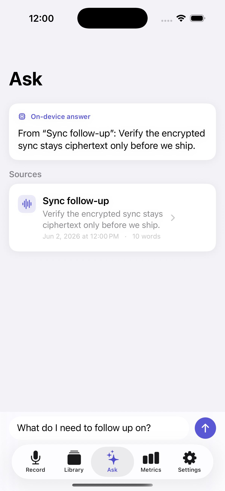
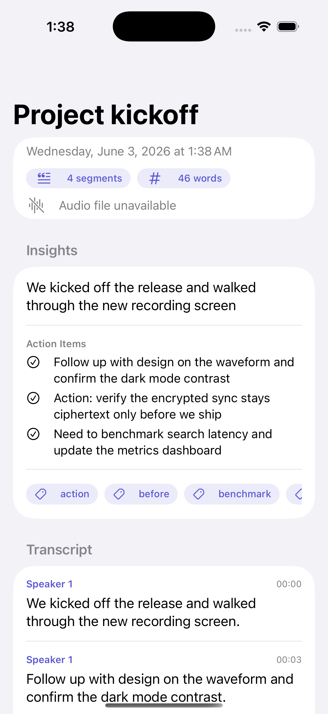

# Murmur

A local-first voice memo app for iPhone, Mac, and Apple Watch. Murmur records and
transcribes spoken notes on device, then uses **Apple Intelligence** and
**on-device semantic search** to summarize them, pull out action items, and let
you *ask questions about your own memos* — a complete retrieval-augmented
generation (RAG) pipeline that never leaves the device. One shared Swift core
powers every platform; the UI is built natively in SwiftUI.

## Screenshots

### iPhone

| Record | Ask | Insights | Library | Metrics |
| --- | --- | --- | --- | --- |
|  |  |  |  |  |

*Ask answers questions from your memos via on-device semantic retrieval +
Apple's foundation model; Insights (summary, action items, topics) are generated
on device too. Both degrade gracefully when Apple Intelligence is unavailable.*

### Mac


### Apple Watch


## Features

- **Ask your memos (on-device RAG).** Ask a question in plain language; Murmur
  retrieves the most relevant memos by *meaning* (on-device embeddings) and has
  Apple's foundation model answer grounded in them, with citations. Fully
  private, with an extractive fallback when Apple Intelligence is unavailable.
- **Semantic + hybrid search.** Memos are embedded with `NLEmbedding`
  (`NaturalLanguage`) and ranked by cosine similarity, then fused with the FTS5
  keyword ranking via Reciprocal Rank Fusion — so search matches both exact words
  and intent.
- **On-device intelligence (Apple Intelligence).** Per-memo summaries, action
  items, and topics via the `FoundationModels` framework using **guided
  generation** (`@Generable`) — entirely on device, with a deterministic
  heuristic fallback on older OSes, watchOS, or when Apple Intelligence is off.
- **On-device capture and transcription.** Audio is recorded with `AVAudioEngine`
  and transcribed with `SFSpeechRecognizer`, preferring on-device recognition so
  speech never has to leave the device.
- **Live transcript while recording.** Transcript segments stream in through an
  `AsyncStream` as you speak, and the saved memo reuses that transcript instead
  of re-running recognition on the file.
- **Durable on-device storage.** Memos persist in a local SQLite database (system
  `sqlite3`, WAL journaling, no third-party deps) and survive relaunch.
- **Full-text search.** An FTS5 index ranks memos by `bm25()` across titles and
  transcripts, with injection-safe prefix matching for as-you-type queries.
- **Playback, browse, delete.** Recorded audio plays back in the detail view;
  the library supports swipe-to-delete.
- **Library metrics.** Aggregate statistics (counts, words, segments, active
  days, and per-memo averages) are computed locally from the memo store.
- **Encrypted sync.** Memos are encrypted with `CryptoService` (keys held in the
  Keychain) before they reach the Go sync server, which only ever stores
  ciphertext and minimal metadata.
- **System integration.** App Intents expose recording, search, and action-item
  creation to Siri and Shortcuts.

## Architecture

Murmur is split into a platform-agnostic core and thin SwiftUI app targets:

```
MurmurCore/      Swift package: audio, transcription, diarization, crypto,
                 search, sync, store, metrics, and App Intents. No UI.
MurmurApp/       SwiftUI app for iOS and macOS (shared sources, MVVM).
MurmurWatchApp/  SwiftUI app for watchOS, focused on quick capture.
server/          Go sync service storing ciphertext-only memo blobs.
```

A few deliberate choices:

- **Shared core, native shells.** All domain logic lives in `MurmurCore` and is
  unit-tested independently of any UI. The iOS and macOS apps build from the same
  SwiftUI sources with platform-specific shells (`TabView` vs `NavigationSplitView`).
- **Observable MVVM with dependency injection.** View models are `@Observable`
  and receive their recorder, transcriber, and store through protocols. Live
  implementations talk to AVFoundation and Speech; mock implementations make the
  view models deterministic and fully testable without hardware.
- **Streaming over polling.** Audio levels and transcript segments are delivered
  as `AsyncStream`s, keeping the recording pipeline reactive and back-pressure
  friendly.
- **Persistence behind a protocol.** `MemoStore` is the observable cache;
  durability lives behind `MemoPersistence`, implemented by a tested SQLite +
  FTS5 store and swapped for an in-memory fake in unit tests.
- **One accent, native materials.** The interface follows the Human Interface
  Guidelines: system grouped backgrounds, `Form`/`List` containers, SF Symbols,
  Dynamic Type, full light/dark support, and a single accent color.

See [`docs/ARCHITECTURE.md`](docs/ARCHITECTURE.md) for the full breakdown,
[`docs/PRIVACY.md`](docs/PRIVACY.md) for the privacy model, and
[`docs/TRADEOFFS.md`](docs/TRADEOFFS.md) for the design trade-offs.

## Privacy model

Raw audio, transcripts, summaries, and action items stay on device; speech
recognition prefers on-device processing; sync transmits only ciphertext and
minimal metadata. The "sync is never plaintext" guarantee is **enforced by a
test** (`testSyncPayloadIsCiphertextNotPlaintext`), not just documented. Full
details in [`docs/PRIVACY.md`](docs/PRIVACY.md).

## Benchmarks

Host micro-benchmark of the SQLite + FTS5 store (Apple Silicon, release, 2,000
synthetic memos): **~4,200 memos/sec** insert, search **p50 ~6 ms / p95 ~10 ms**.
These are host engine numbers (not device numbers) showing local search/indexing
is not the bottleneck. Reproduce with `swift run -c release MurmurBench`; see
[`docs/BENCHMARKS.md`](docs/BENCHMARKS.md).

## Build & test

Requires Xcode 16+. The Xcode project is generated from `project.yml` with
XcodeGen (`brew install xcodegen`).

```bash
# Generate the Xcode project (only needed after editing project.yml)
xcodegen generate

# Core logic
cd MurmurCore && swift test

# Store benchmark
cd MurmurCore && swift run -c release MurmurBench

# Apps
xcodebuild -scheme MurmurApp      -destination 'generic/platform=iOS Simulator' build
xcodebuild -scheme MurmurMacApp   -destination 'platform=macOS' test
xcodebuild -scheme MurmurWatchApp -destination 'generic/platform=watchOS Simulator' build

# Sync server
cd server && go test ./... && go build ./cmd/murmurd
```

To run the optional encrypted sync, start the server and launch the app with
`MURMUR_SYNC_URL` pointing at it.

## Continuous integration

[GitHub Actions](.github/workflows) runs the `MurmurCore` package tests, the
macOS app tests, an iOS build, and the Go server tests on every push.

## License

MIT. See [LICENSE](LICENSE).
