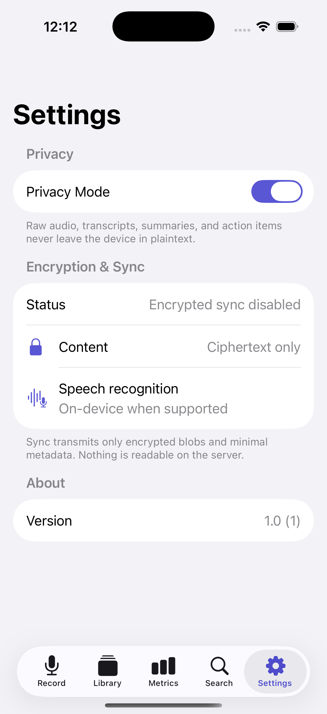

# Murmur

A local-first voice memo app for iPhone, Mac, and Apple Watch. Murmur records,
transcribes, and organizes spoken notes entirely on device, and syncs only
encrypted blobs to its companion server. One shared Swift core powers every
platform; the UI is built natively in SwiftUI.

## Screenshots

### iPhone

| Record | Library | Metrics | Settings |
| --- | --- | --- | --- |
|  |  |  |  |

### Mac


### Apple Watch


## Features

- **On-device capture and transcription.** Audio is recorded with `AVAudioEngine`
  and transcribed with `SFSpeechRecognizer`, preferring on-device recognition so
  speech never has to leave the device.
- **Live transcript while recording.** Transcript segments stream in through an
  `AsyncStream` as you speak, and the saved memo reuses that transcript instead
  of re-running recognition on the file.
- **Local search.** A tokenized search index ranks memos by query relevance
  across titles and transcripts.
- **Library metrics.** Aggregate statistics (counts, words, segments, active
  days, and per-memo averages) are computed locally from the memo store.
- **Encrypted sync.** Memos are encrypted with `CryptoService` (keys held in the
  Keychain) before they reach the Go sync server, which only ever stores
  ciphertext and minimal metadata.
- **System integration.** App Intents expose recording, search, and action-item
  creation to Siri and Shortcuts.

## Architecture

Murmur is split into a platform-agnostic core and thin SwiftUI app targets:

```
MurmurCore/      Swift package: audio, transcription, diarization, crypto,
                 search, sync, store, metrics, and App Intents. No UI.
MurmurApp/       SwiftUI app for iOS and macOS (shared sources, MVVM).
MurmurWatchApp/  SwiftUI app for watchOS, focused on quick capture.
server/          Go sync service storing ciphertext-only memo blobs.
```

A few deliberate choices:

- **Shared core, native shells.** All domain logic lives in `MurmurCore` and is
  unit-tested independently of any UI. The iOS and macOS apps build from the same
  SwiftUI sources with platform-specific shells (`TabView` vs `NavigationSplitView`).
- **Observable MVVM with dependency injection.** View models are `@Observable`
  and receive their recorder, transcriber, and store through protocols. Live
  implementations talk to AVFoundation and Speech; mock implementations make the
  view models deterministic and fully testable without hardware.
- **Streaming over polling.** Audio levels and transcript segments are delivered
  as `AsyncStream`s, keeping the recording pipeline reactive and back-pressure
  friendly.
- **One accent, native materials.** The interface follows the Human Interface
  Guidelines: system grouped backgrounds, `Form`/`List` containers, SF Symbols,
  Dynamic Type, full light/dark support, and a single accent color.

## Privacy model

- Raw audio, transcripts, summaries, and action items stay on device in plaintext.
- Speech recognition prefers on-device processing when the device and locale support it.
- Sync transmits only ciphertext and minimal metadata. The server cannot read memo content.

## Build & test

Requires Xcode 16+. The Xcode project is generated from `project.yml` with
XcodeGen (`brew install xcodegen`).

```bash
# Generate the Xcode project (only needed after editing project.yml)
xcodegen generate

# Core logic
cd MurmurCore && swift test

# Apps
xcodebuild -scheme MurmurApp      -destination 'generic/platform=iOS Simulator' build
xcodebuild -scheme MurmurMacApp   -destination 'platform=macOS' test
xcodebuild -scheme MurmurWatchApp -destination 'generic/platform=watchOS Simulator' build

# Sync server
cd server && go test ./... && go build ./cmd/murmurd
```

To run the optional encrypted sync, start the server and launch the app with
`MURMUR_SYNC_URL` pointing at it.

## Continuous integration

[GitHub Actions](.github/workflows) runs the `MurmurCore` package tests, the
macOS app tests, an iOS build, and the Go server tests on every push.

## License

MIT. See [LICENSE](LICENSE).
