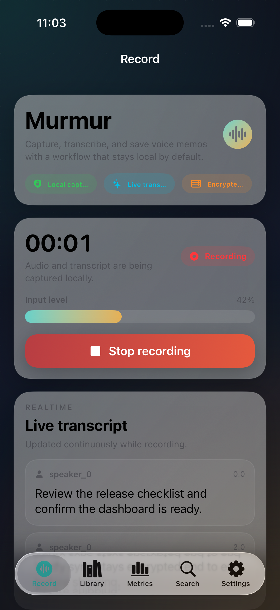
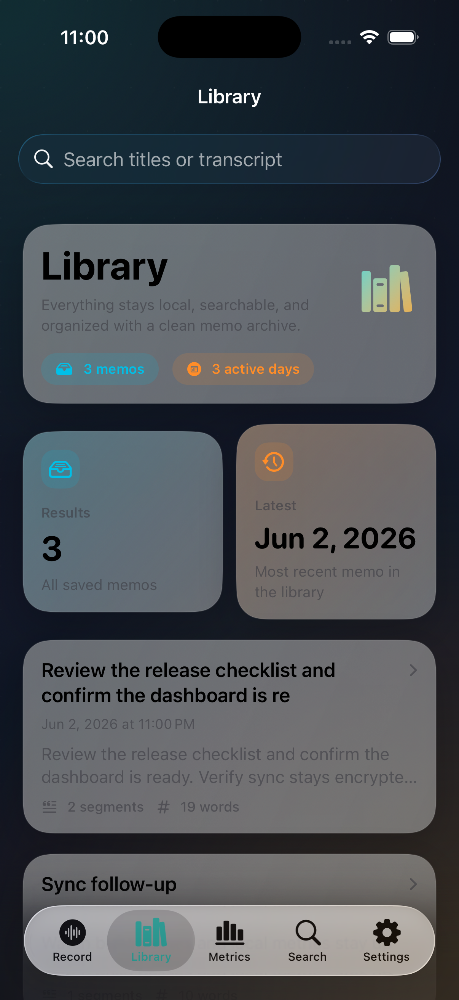
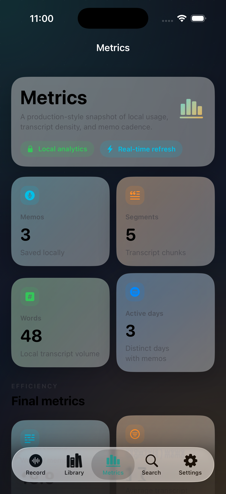
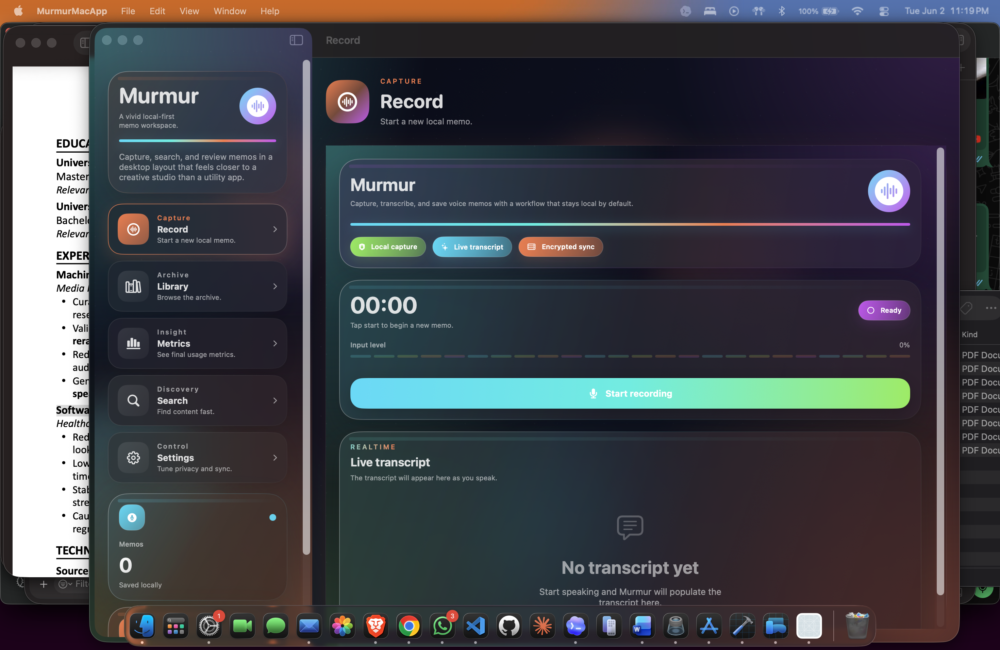
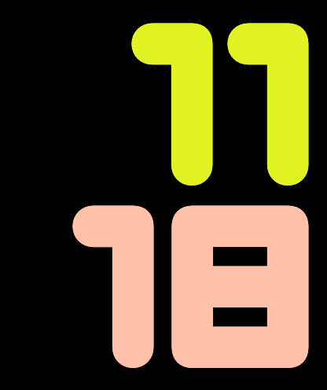

# Murmur

Murmur is a privacy-first voice memo app for Apple platforms with local transcription, local summaries, encrypted sync, and a metrics dashboard that shows the final state of a memo library.

## What It Does

- Records voice memos on iPhone, Mac, and Apple Watch.
- Transcribes speech locally when the device supports it.
- Builds summaries, action items, and search indexes on device.
- Stores memo content locally and syncs ciphertext-only blobs.
- Surfaces library, search, and usage metrics in a single workflow.

## Product Design

- Dark, high-contrast interface with layered depth and restrained accent colors.
- Large recording states with explicit status, progress, and transcript feedback.
- Card-based library, detail, search, and metrics screens.
- Settings that clearly communicate privacy and encryption behavior.
- Watch UI optimized for quick capture and glanceable feedback.

## Final Metrics

The Metrics tab presents the final operational snapshot for the local memo library:

- Total memos
- Total transcript segments
- Total words
- Active days
- Average words per memo
- Average segments per memo
- Average words per segment
- Memos per active day

These values are calculated locally from the current memo store and refresh in-app without network access.

## Architecture

- `MurmurCore` contains the shared model, transcription, summarization, crypto, search, sync, and metrics logic.
- `MurmurApp` and `MurmurMacApp` provide the main SwiftUI experience.
- `MurmurWatchApp` provides the watch capture flow.
- `server/` contains the Go sync service that stores ciphertext blobs and minimal metadata.

## Privacy Model

- Raw audio, transcripts, summaries, and action items remain on device in plaintext.
- Sync traffic is encrypted before leaving the device.
- Speech recognition prefers on-device processing when supported.

## Running Locally

- Open `Murmur.xcodeproj` in Xcode and run the iPhone, Mac, or Watch scheme.
- Or build from the command line with `xcodebuild`.
- Run the sync server from `server/cmd/murmurd` if you want encrypted sync.

## Validation

- `swift test` for `MurmurCore`
- Xcode app builds for `MurmurMacApp` and `MurmurWatchApp`
- `go test ./...` and `go build ./cmd/murmurd` in `server`

## Screenshots

### iOS

| Record | Library | Metrics |
| --- | --- | --- |
|  |  |  |

### macOS

| Desktop shell |
| --- |
|  |

### watchOS

| Capture flow |
| --- |
|  |

## License

MIT License. See `LICENSE`.
